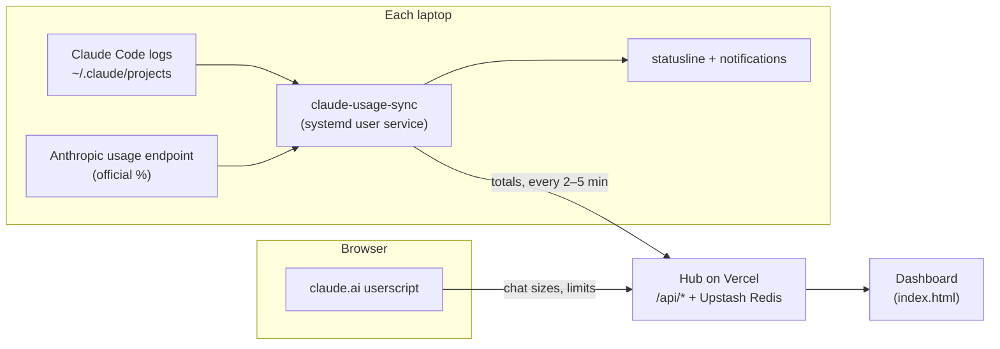

# claude-usage-hub

Tracks the usage of one Claude plan across several laptops.

Each laptop runs a small service. It reads that laptop's Claude Code logs and the plan's official
usage figures, and sends totals to a hub (a Vercel project with an Upstash Redis database). The
hub estimates how the official limits split between laptops and people, and serves a dashboard.



## Components

- `collector/claude-usage-sync.py`: the service on each laptop, run as a systemd user unit.
  - Reads `~/.claude/projects/**/*.jsonl` and prices each API call at API rates.
  - Reads the official limits through the laptop's Claude Code login.
  - Sends totals to the hub every 2–5 minutes, and updates itself from the hub.
  - Shows a desktop notification when the session passes 80% and 95%, and when the week passes
    90% and 97%.
- `collector/claude-statusline.py`: a Claude Code statusline, e.g.
  ```
  claude-usage-hub · Opus 5.5 (1M) · ctx 42% · session 21% ↻1h37m (chat ≈17) · ~150 msgs left · week 92% (chat ≈24)
  ```
  It shows context used, the session % with its reset time, this chat's part of the session and
  of the week, and how many messages are left at this chat's recent cost per message.
- `collector/setup.sh`: installs the two pieces above and the userscript on a laptop.
- `userscript/`: an optional userscript for claude.ai (Violentmonkey or Tampermonkey).
  - Shows the chat's approximate context size and the plan's limits under the message box.
  - Reports chat sizes to the hub.
  - Reads only responses the page has already loaded; it makes no requests to claude.ai.
- `api/`: Vercel functions that store the data, fit the estimates, forecast the week, and serve
  the dashboard's data.
- `index.html`: the dashboard.

## Dashboard

- **Overview:**
  - the official session, weekly and per-model limits, and each person's estimated share of them;
  - a forecast for the end of the week;
  - the laptops' sync status;
  - the cost of one more message in each open session, and whether `/compact` would lower it;
  - the last 24 hours.
- **Activity:** recent sessions (context size, compactions, models, subagents); usage by platform,
  model and project; claude.ai chats.
- **History:** past weeks and 5-hour sessions, how past forecasts compared with the real end of
  each week, and all-time stats.
- **Accuracy:** per-laptop totals, the measured error of the estimates, and what each model costs
  against the limits.

## How the estimates work

Anthropic reports one % per limit, for the whole account. It doesn't publish how much each model
or token counts toward a limit, so the hub fits that from readings the laptops take while they
are in use: the official % next to the logged usage at the same moment. Within a 5-hour window:

```
official % = floor(a · U + O)
```

- `U` is the logged usage at API prices, with weights for cache reads and for each model family.
- `a` is the rate that turns that usage into a % of the limit.
- `O` is usage that no synced laptop logged (claude.ai, other computers). It can only grow.

The fit picks the rates that explain the readings with the least unlogged usage. The error shown
on the Accuracy tab comes from checking past windows against the official %. Figures marked `~`
are estimates; official figures are shown as reported. Where there isn't enough data yet, the
dashboard says "calibrating".

The weekly forecast uses the last three days' pace, and a range taken from replaying past days
of the same account. `kit/HOW-IT-WORKS.md` has the details.

## Setup

Requirements:
- Linux laptops with systemd, each logged into Claude Code.
- `python3`, `curl` and Node.js.
- A Vercel account.

The installer is Linux-only; the collector itself is plain Python. `kit/SETUP.md` covers macOS and
Windows.

1. Deploy the hub and add a database:
   ```bash
   npx -y vercel@59.23.2 login
   npx -y vercel@59.23.2 deploy --prod --yes          # the "Aliased" line is the hub's address
   npx -y vercel@59.23.2 integration add upstash/upstash-kv
   ```
2. Create a master key and one key per person, and store them as production environment
   variables:
   - `HUB_KEY`: the master key.
   - `HUB_VIEWERS`: a JSON map from each personal key to its person's name.

   A personal key can only send usage under its own person's name.
3. Point the code at the hub's address and deploy again:
   ```bash
   python3 kit/configure.py https://<your-hub>.vercel.app
   npx -y vercel@59.23.2 deploy --prod --yes
   ```
4. On each laptop, with that person's key:
   ```bash
   curl -fsSL https://<your-hub>.vercel.app/collector/setup.sh | bash -s -- <KEY> "<Name>'s laptop" <Name>
   ```
   It can be run again safely. Options: `--dry-run`, `--no-browser`, `--reassign`.
5. Open `https://<your-hub>.vercel.app/#key=<KEY>` once in each browser.

`kit/SETUP.md` has the same steps in full, written so that Claude Code can carry them out.
`python3 tools/package.py` builds a zip of the code and the kit, without notes or data, for
setting up a separate hub.

## Privacy

- **What leaves a laptop:** token counts, costs, times, model names, project folder names and
  session titles. Prompts, code, transcripts and credentials are not sent.
- **Other people's names:** the hub hides project names and titles from everyone except their owner.
  Usage figures are visible to everyone with a key.
- **Validation:** the hub checks every field it receives against an allowlist.

Anthropic's Consumer Terms don't allow one account to be shared between people. The hub works the
same for one person on several laptops.

## Development

```bash
node tools/test-fit.mjs          # regression test of the fit on recorded readings
node tools/test-unlogged.mjs     # the "not synced" signal
bash userscript/test/run.sh      # userscript against a mock claude.ai (needs Firefox and web-ext)
python3 userscript/build.py      # rebuild the userscript; bump VERSION to push an update
npx -y vercel@59.23.2 deploy --prod --yes
```

- **Collector updates:** laptops pick up a new collector from the hub within 6 hours of a deploy.
- **Prices:** after changing the collector's price table, bump `PRICE_VERSION`.
- **Testing:** use local mocks. A burst of requests to the live hub trips Vercel's bot protection,
  which also blocks the laptops' syncs for a while.

## Layout

| Path | Contents |
|---|---|
| `index.html` | Dashboard (inline JS and CSS) |
| `api/` | Vercel functions; `_fit.js`, `_combine.js` (fit), `_forecast.js`, `_split.js`, `_unlogged.js` |
| `collector/` | Laptop service, statusline, `setup.sh`, `install.sh` |
| `userscript/` | `core.js` + `main.js`, built by `build.py` into `claude-usage.user.js` |
| `kit/` | Setup guide, architecture notes, `configure.py` |
| `tools/` | Tests and maintenance scripts (not deployed) |
